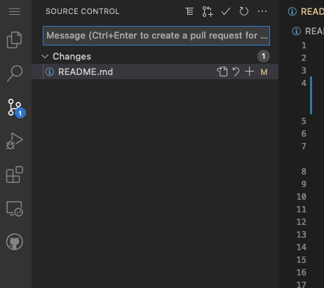

# Pleb Miners
Bitcoin home mining resource for the plebs!

Our goal is to collect all the info and resources we can to help plebs get started on their own home mining efforts. This will be perpetually a work in progress as more resources, guides, and example builds are submitted by plebs across the world.

## Overview
Start with [@Diverter_NoKYC](https://twitter.com/Diverter_NoKYC)'s  great article: [Mining for the Streets](https://diverter.hostyourown.tools/mining-for-the-streets/); and [@econoalchemist](https://twitter.com/econoalchemist)'s in-depth article on home mining: [Home mining for non-KYC Bitcoin](https://www.econoalchemist.com/post/home-mining-for-non-kyc-bitcoin)

## Topics
* ASIC Profitability
* Purchasing
* Electrical Wiring
* Air Cooling & Noise Suppression
* [Immersion Cooling](immersion_cooling/README.md)
* Miner Setup & Remote Access
* Mining Pools
* [API Access / Automated Control](api/README.md)
* Maintenance/Repair

## How to contribute to this repo
Create a Github account.

Use Github's integrated web-based Visual Studio Code editor! Browse to:

[https://github.dev/satoshi-anonymoto/pleb-miners](https://github.dev/satoshi-anonymoto/pleb-miners)

You'll see the repo's directory structure and can just navigate to the file that you want to edit or you can add new files and folders.

When you're done making changes, click the "Source Control" icon, review your changes, type in a commit message (should briefly explain your changes), then click the checkmark icon at the top of the left menu panel.

Your changes will be created as a "pull request" which the maintainers will review. If everything looks good, your PR will be merged into the main repo. And once it's merged, your github user will be automatically listed as a contributor!
