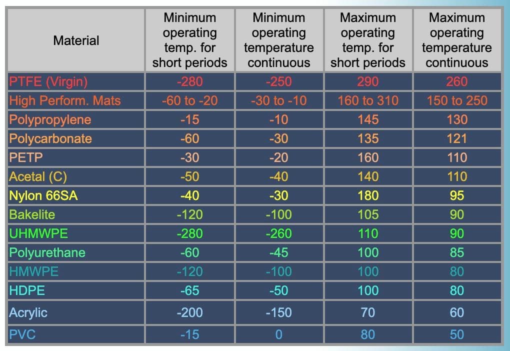

# Immersion Cooling
The most effective way to keep your ASICs at a constant, consistent temperature is to run them fully submerged in a special liquid that pumps the heat out to heat exchangers. The bonus side effect is that the ASICs run silently in the liquid with only a heat exchanger fan running outside.

An added benefit if you live in colder climates is that you can efficiently reuse the heat by [integrating it with your central heating](https://twitter.com/Betahedged/status/1428044220665896967) or perhaps for [recreational use](https://twitter.com/JessePeltan/status/1287518077291241473). By offsetting existing heating costs with heat harnessed from mining, your ASICs may stay cost-competitive longer even in the worst market conditions (e.g. price and/or difficulty pressures).

Most of the information here was gleaned from the [Immersion Cooling Technology Talk](https://t.me/ImmersionCoolingTechnologyTalk) Telegram group.

Also from discussions in this [twitter thread](https://twitter.com/SatoshiAnon/status/1431610380212637704).

### Does immersion cooling make sense for you?
It depends on a number of factors -- primarily scale -- but also your own priorities and interests.

If you're running a single S9 that you bought for $450, the raw ROI math for an immersion setup will be tough; even [the simplest immersion cooling setup](pleb_builds/pleb_tank.md) is $442. However, if you're going to reuse the heat or if noise mitigation is paramount, then maybe it is worth it for you. Or maybe this whole immersion thing just sounds fascinating and you love to tinker.

For a single 3kW ASIC ($4k-10k!) the math starts to change for the better. An important consideration is that your miners should see a [longer operating lifespan](https://www.youtube.com/watch?v=QHJJp9scB0c) if they're kept in the kind of stable, consistent temps that are possible with immersion cooling. The day-to-day ROI on an immersion cooling setup might not be great, but you should really think of it as buying extra weeks, months, or even years for your miners.

## Terminology
* dielectric fluid: a liquid that doesn't conduct electricity and is therefore safe to submerge electronics in. These are very expensive, custom manufactured oils.

* single loop: The cooling oil is directly pumped through a radiator to cool it down and then fed back into the ASIC reservoir.

* double/dual loop: The cooling oil is pumped to a plate heat exchanger where it transfers heat to an adjacent water line. The heated water is then pumped in its own loop to a radiator to cool it down.

* single phase: The cooling oil always stays in a liquid state as it's pumped around the system.

* dual phase: The cooling oil is boiled off by the hot electronic components and that resulting gas is captured and cooled so that it condenses back to a liquid. This is not for the plebs!

## Basic design tradeoffs - single loop
Single loop is the simplest and least expensive option for small pleb setups.

pros:
* Simple. Only need a container, the expensive cooling oil, one strong enough pump, a modest radiator, fan, and some misc hoses and connectors.
* Lower starting costs since there isn't much hardware to buy.

cons:
* Pumping the oil through all the radiator loopbacks is difficult so you have to spec out the pump appropriately.
* Radiator is less efficient at shedding heat when filled with oil instead of water due to the thermal conductivity properties of the liquids, meaning a bigger heat exchanger is required. At 40°C:
  * Water       0.631 W/m.K
  * BitCool     0.137 W/m.K
  * ThermaSafeR 0.129 W/m.K
* Uses more oil (most expensive part of any system) than a double loop system.
* Need to keep the hose lines short to minimize amount of oil that has to be pumped around; limits installation options.
* Will quickly hit a practical limit where it can't dissipate enough heat. If plebs think they'll want to scale up over time, better to just go double loop from the start.

## Basic design tradeoffs - double loop
A must for any immersion setup at scale, but also has some compelling reasons for small-scale plebs.

pros:
* Minimizes the total cooling oil needed in the system.
* Water is easier to pump so longer runs to the radiators are more practical.
* Only real option once setups go beyond 1-2 high power (3kW+) ASICs (really rough guess).
* Easier to incorporate into home heating uses (I think?).

cons:
* Higher initial starting costs. Oil pump needed (though can have much more modest specs), water pump, plate heat exchanger block, then all the same radiator, fan, hoses, etc.
* Some seasonal water mix adjustments for freezing temps.

## Material compatibility
Be sure all components are compatible with the dielectric fluid. [Engineered Fluids' Material Compatibility Guide](https://www.engineeredfluids.com/material-compatibility) is a good reference. A very short TLDR;
* Metal: good
* CPVC good, PVC not good
* In general, components compatible with hydraulic oils are compatible with dielectric fluids
* Pump and connectors' o-rings and seals must not be "regular rubber", but of Viton/FMK quality or similar (ref. the above point)

## Cooling parameters, data, design considerations
* S19s reach thermal shut down at [160-170°F oil temps](https://t.me/ImmersionCoolingTechnologyTalk/16504)
* Plebs report steady-state oil temps around 125F, chips in the low 70°C.
* Engineering Fluids guidelines state 2-4L/min per kW for minimum oil circulation rate.
* Oil flow through the ASIC is key. Some miners [leave the case fans on](https://t.me/ImmersionCoolingTechnologyTalk/15448) to generate flow.
* Oil-to-water [plate heat exchanger efficiency](https://t.me/ImmersionCoolingTechnologyTalk/16376): 120°F oil input heats the water to 110°F
* [Heat rejection calculator](http://www.machinetech.co.nz/Plastics+Equipment/Technical+Information/Heat+Rejection+Calculation++-++kW.html). Note: only for heat       rejection to one material. Can be useful for modeling dual loop systems but does not account for heat exchanger and coolant loop heat transfer.

## Containers
Remember that the cooling oil is the most expensive part of the system. Do not cut corners on a container that may end up leaking your oil!

There are a few DIY options listed to build your own container. A custom build is the best way to minimize wasted volume in your container and therefore minimize the amount of oil required.

### Fish tanks
Have been used for quick, short-term experiments and in some plebs' main setups. Some concerns about the durability of corner joins holding up to the hot oil over time but [at least one report](https://t.me/ImmersionCoolingTechnologyTalk/16504) of the silicon edge seals being compatible with BitCool.

### Off-the-shelf metal containers
Huge array of possibilities here. Steel or alumninum [don't have any issues](https://t.me/ImmersionCoolingTechnologyTalk/16524) interacting with the cooling oil. Again take care to pay attention to any seams.

### DIY acrylic builds
Acrylic is not the cheapest raw material to work with and requires a saw (ideally a table saw) or perhaps a manual scoring knife. But you can build exactly to your size specifications and have the added benefit of  transparency to see your immersed ASIC in action. Acrylic solvent makes a watertight seal between edges. 

See this [tutorial for making a fish tank](https://www.youtube.com/watch?v=H8LGIrVJQZs). In the fish tank world they say you have to use 8-12mm thick acrylic. Small custom enclosures might be able to get away with slightly thinner acrylic.

### DIY steel builds
Very cheap raw material. But you have to be able to custom cut pieces and weld them.

### How to fill excess volume
If your container is oversized, you'll end up wasting expensive cooling oil on the unused space. It might also make it harder to create a directed current flow across your ASICs. So ideally you'll just fill that empty space with something that displaces the volume.

But take care in deciding what you put in there: see the note below on [material max temps](#selection-of-materials).

I've seen people put jugs of water in the tanks to fill up space, but that water would act as a kind of heat battery. Plus it's a bad idea to have any water in your immersion tank (jug leaks, water reaches miners. Disaster).

_uninformed noob guess:_ Instead it seems better to have empty, sealed glass containers. No heat battery, no water risk. Even thin glass should be good [up to 300°F](https://www.berlinpackaging.com/at_what_temperature_will_glass_break/). Just make sure the container's seals can withstand the oil heat (up to 160°F) as well. A [glass juice container](https://www.target.com/p/64oz-glass-straight-side-pitcher-with-lid-threshold-8482/-/A-79474147) might be tall enough that the lid isn't even submerged.

## Plate heat exchangers
The oil-to-water transfer block for dual-loop systems. Plate heat exchangers with smaller ports (3/4", 1"?) will likely be harder for a pump to push the cooling oil through. Need more testing. For now just opt for the 1.25" ports?

* [5"x12" 20-plate 1" ports](https://www.amazon.com/Mophorn-Plate-Exchanger-Water-Stainless/dp/B07333GY5N/): $99, 80k BTU
* [5"x12" 30-plate 1.25" ports](https://www.amazon.com/dp/B085BYZFH8/): $140, no listed BTU
* [5"x12" 10-plate 1.25" ports](https://www.amazon.com/dp/B073ZMQLQ9/ref=cm_sw_r_tw_dp_YBK78TMJ28RV1GYV073G?_encoding=UTF8&psc=1): $143, 110k BTU (suspiciously high?)
* [5"x12" 60-plate 1.25" ports](https://www.amazon.com/dp/B07334VF8T/): $180, 150k BTU;
* [5"x12" 60-plate 1.25" ports](https://www.amazon.com/VEVOR-Exchanger-Stainless-Hydronic-Heating/dp/B08N558K97): $190, no listed BTU. [Used by CoinHeating](https://t.me/ImmersionCoolingTechnologyTalk/16568)
* [5"x12" 20-plate 1.25" ports](https://www.amazon.com/dp/B073ZNGL48/ref=cm_sw_r_tw_dp_CBSXQ68P0JK9P52RSQSP?_encoding=UTF8&psc=1): $165, 170k BTU (suspiciously high?)

## Oil pump candidates
* [1/4 HP submersible](https://www.menards.com/main/plumbing/pumps-tanks/utility-sump-pumps/barracuda-reg-1-4-hp-thermoplastic-submersible-utility-pump/91250/p-1444428713624-c-1489153238832.htm?tid=5737724981746642496&ipos=8): $56, 1500gph, 456W. [Works in hot oil](https://t.me/ImmersionCoolingTechnologyTalk/16593)
* [1/4 HP submersible high flow](https://www.amazon.com/dp/B08BLTM97Q/ref=cm_sw_r_tw_dp_08FW16JB91VWQ5PP4F60?_encoding=UTF8&psc=1): $50, 2400gph, 456W
* [1/3 HP submersible high flow](https://www.amazon.com/dp/B000X07GQS/ref=cm_sw_r_tw_dp_D5J9KFRC67JP0JGZY0T8?_encoding=UTF8&psc=1): $58, 2400gph, 492W
* [Wayne 1/6 HP submersible](https://www.amazon.com/dp/B0009X8O2E/ref=cm_sw_r_tw_dp_KK7E7V5RC0SMCCVK5ZWX): $77, 3000gph, 300W
* [Iron Might 1/15 HP](https://smile.amazon.com/dp/B00HEAOTEM/ref=cm_sw_r_tw_dp_TGZ3M41XQ7F02P4KSDRX): $148, 40gpm/2400gph, 1.3A / 156W. Designed for 24hr operation.

Need to test different pumps. The 1/4 and 1/3 HP submersible pumps are known to work thanks to [CoinHeating](https://t.me/ImmersionCoolingTechnologyTalk/16593) but consume a lot of power. Might need that power to push the cooling oil through the plate heat exchanger, though. And even though they state that they have a 120°F shut-off, in [real-world tests](https://t.me/ImmersionCoolingTechnologyTalk/16765) they ran to an oil temp of 160°F.

The Wayne 1/6 HP pump looks like a potential compromise between reducing HP a bit in exchange for burning less electricity.

The Iron Might 1/15 HP pump looks temptingly more efficient. If it lives up to its stated numbers, its 3x price will easily be offset by its much lower energy consumption. However, it has to be installed below the water line to be gravity fed and it is not submersible. So your container would need ports drilled through the side or bottom.

There are also cast iron brushed motor pumps that look impressive but they all say that the brushes should be inspected every 100hrs of run time. They obviously aren't meant for continuous operation. They're probably inefficient power hogs, too.

There are various other submersible pumps that boast 2400gpm rates but only consume 100-200W. Reviews often looked mixed about how much power these pumps actually have. Be skeptical.

### Guesstimating oil pump requirements
Let's double the high end of the 2-4L/min per kW minimum guideline. And then add another 25% buffer. Then assume the pump's flow rate is cut in half by pumping the thicker cooling oil.

So for a 7.2kW system (two Whatsminer M31s+):

`7.2 * 4*2 * 1.25 / 3.785L/gal * 60min/hr * 2 = 2282 gal/hr`

In theory, any of the 2400gph pumps above should suffice.

## Water pump candidates
* [3-speed hot water circulation pump, food grade](https://www.amazon.com/dp/B072M9C7X7/ref=cm_sw_r_tw_dp_DPEYCJE8BE2P00ZZDM0T): $98, 9.5gpm/570gph, 93W, fluids up to 212°F

The 3-speed hot water circulator pump is interesting because it's purpose-built for exactly our use case: hot water circulation. The speed settings might make it more tunable for small pleb setups that don't need it running full-out all the time. We could consider the same cheap 1/4 HP submersible pumps above but this pump's very low power consumption (even on its highest setting) will more than make up for its 2x in price. Presumably a pump meant for hot water will last longer than the submersible utility pumps that have a stated 120°F thermal cutoff limit. This pump is designed to push water through a whole house so a short water line through a radiator shouldn't be a problem (but need to test!).

### Guesstimating water pump requirements
The water pump math will depend on the size of the radiator and also the size of the plate heat exchanger ports (3/4", 1", 1.25").

## Water-to-air heat exchangers (aka radiators)
Will need to be custom sized for each individual setup. Also need a fan to either push or pull air through the radiator.

* [16"x16" radiator](https://smile.amazon.com/dp/B07BB26LGF): $159, 65k BTU
* [18"x20" radiator](https://www.amazon.com/dp/B07HDSCPPP/ref=cm_sw_r_tw_dp_0D89ABSTWZE4YQG3HQTM): $165, 133k BTU with 180°F Entering Water Temp., 15 GPM and 2000 CFM
* [24"x24" radiator](https://www.amazon.com/dp/B07HD7ZDJ5/ref=cm_sw_r_tw_dp_DBXG9XYRXRV4193YGPNF): $249, 210k BTU
* [16" fan](https://amazon.com/Universal-Electric-Radiator-Cooling-Mount/dp/B014KK7LDY): $41, 3000cfm, 120W

### Guesstimating performance of the radiator
Rough estimate: take the lower BTU rating and cut it in half for a cooling application. Then convert the value to kW equivalent. Example w/a 65,000 BTU radiator:

`65,000/2 * 0.00029307107kW/BTU/hr = 9.5kWh`

In theory this radiator could keep up with dissipating heat from three 3kW ASICs, though in the real world we also need to consider the temperature differential of the ambient air and the airflow provided by the fan. And there is inefficiency throughout the system so perhaps more realistic to only expect 2/3 of the performance.

_The math and assumptions here need to be vetted. Consider them highly suspect._

## Dielectric cooling oil
* [DCX ThermaSafe R](https://cryptocooling.eu/#fluid): $240 for 24L; only ships from Poland.
* [Engineering Fluids BitCool](https://www.engineeredfluids.com/bitcool): $180 for 20L (5.28gal); ships from Texas.
* Mineral Oil: Usable for inexpensive miners (e.g. S9) or experiments but is generally expected to have impurities that will degrade the electronics.

## Water loop considerations
To keep your water loop clear of any corrosion or buildup, [use distilled water](https://t.me/ImmersionCoolingTechnologyTalk/13031) with [antifreeze](https://t.me/ImmersionCoolingTechnologyTalk/14126), the key ingredient of which is [ethylene glycol](https://t.me/ImmersionCoolingTechnologyTalk/13019). The ratio of water to glycol changes in the winter (_guidance on ratios needed_).

## Grounding to discharge static buildup
Need more info. Start [here](https://t.me/ImmersionCoolingTechnologyTalk/13069)

## Selection of materials
Note the temperature ratings for different materials (°C):

> a) avoid any thermoplastic, polymers in the immersion enclosure - especially for the tank structure. HDPE is resistant within specific temperature range but there are plenty other materials you can choose which will last for a lifetime.  
> b) container of water left for the long time in the tank with hot dielectric and 20-50k usd hardware is asking for trouble.  
> c) plan for disaster, plan for abuse by the user - we want to take into account not maximum working temperatures but maximum “fuckup happens” temperature.  
> - [Maciek DCX](https://t.me/ImmersionCoolingTechnologyTalk/16913)

## Connectors, pipes, hoses

## Preparing ASICs for immersion

### Cleaning

### Software, fan spoofing
You cannot just dunk your asic in immersion coolant as is (with stock firmware and fans). The fans are made for air, not liquid which will slow them down and trip the asic (fans are monitored, it will assume the fans are faulty since they are not spinning up to the required speed). Removing the fans entirely has the same effect, you will not be able to run the asic without them (as is).

You will need either [fan spoofers](https://t.me/ImmersionCoolingTechnologyTalk/17936) or special firmware.

#### Fan spoofers
* [Fan spoofers](https://t.me/ImmersionCoolingTechnologyTalk/18688) are the easiest (plug n' play, just remove the fans and plug in the fan spoofers where the fans were connected), they will trick the asic to believe it has fans running
* They will cost you between $5 - $10 per spoofer
* Different asics have different pin connections, [so there are no *one* fan spoofer to rule them all unfortunately](https://t.me/ImmersionCoolingTechnologyTalk/18151)
* E.g. Antminer S17/19 have [flat 4-pin connectors](https://t.me/ImmersionCoolingTechnologyTalk/13281), and requires 4 pieces ([it has 4 monitored fans](https://www.google.com/search?q=antminer+s19&client=firefox-b-d&source=lnms&tbm=isch&sa=X&ved=2ahUKEwi_-_ODy9jzAhWYRPEDHWGiB9QQ_AUoAXoECAEQAw&biw=2560&bih=1315#imgrc=X0IFSbHAqYJDSM))
* E.g. Whatsminer's have only [two main fans](https://www.google.com/search?q=whatsminer+m30&client=firefox-b-d&source=lnms&tbm=isch&sa=X&ved=2ahUKEwjehv6JzdjzAhW6SfEDHfMaC9QQ_AUoAXoECAEQAw&biw=2560&bih=1315#imgrc=lHwKoW_DLz7fIM), with varying connector type (4-pin or [6-pin](https://t.me/ImmersionCoolingTechnologyTalk/15580)) depending on the model, and they also monitor the power supply unit (PSU) fan which might be of a different connector type
* Make sure to check your fan connector types and/or inform your supplier of what asic model you have so that you receive the correct ones
* There are many who sell fan spoofers (make sure to verify they can be trusted). [DCX](https://dcx.eu/) seems to be a reliable supplier.

#### Firmware
* Typically needs to be flashed to the asic with a micro SD card
* For Whatsminer's, you can ask and get official immersion firmware [here](https://t.me/whatsminercommunity). They will ask you to sign a warranty waiver.
* There are lots of 3rd party firmware out there. They allow you to have more control of your asic and adjust different settings (e.g. over and underclocking). It will typically cost you something like 2% +/- of your hash. Be careful when choosing, and verify they can be trusted. Known and recommended 3rd part firmware (incomplete list):
* [Braiins OS+](https://braiins.com/os/plus)
* [VNISH](https://t.me/minerspeak/144462)

## Sample builds
* [BuildImmersion's (planned) single asic build](pleb_builds/buildimmersion.md)
* [CoinHeated's double loop pool heating system](pleb_builds/coinheated.md)
* [Satoshi Anonymoto's (planned) two-ASIC/7.2kW build](pleb_builds/satoshi_anonymoto.md)
* [The Pleb Tank (proposed)](pleb_builds/pleb_tank.md)
